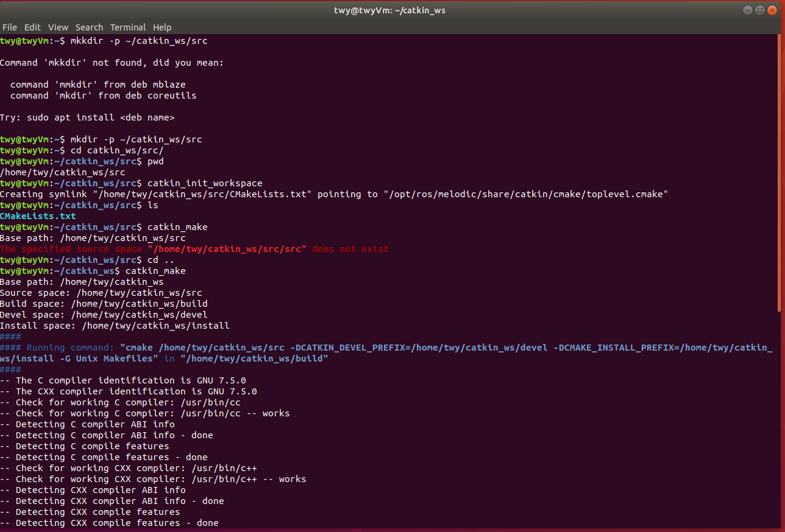
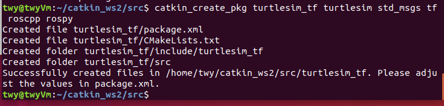
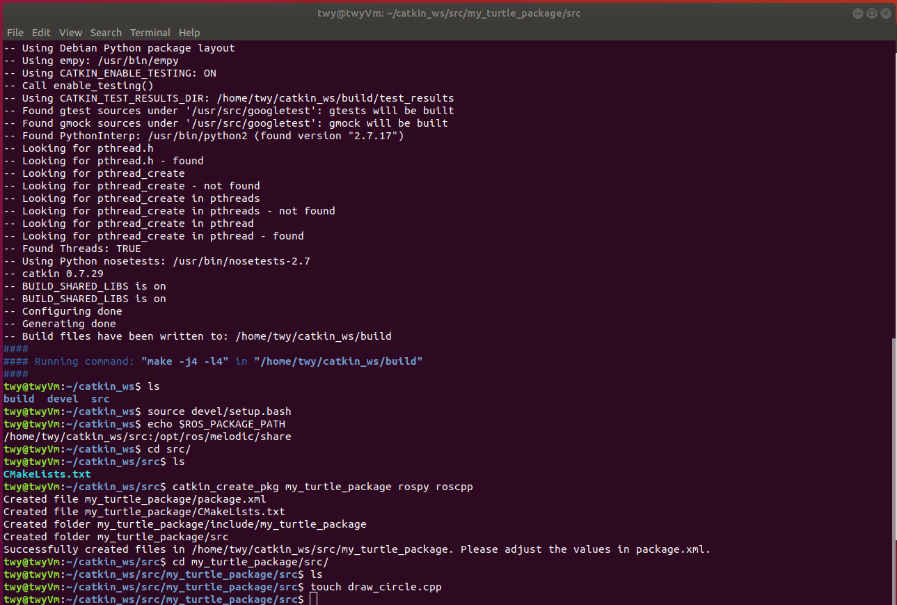
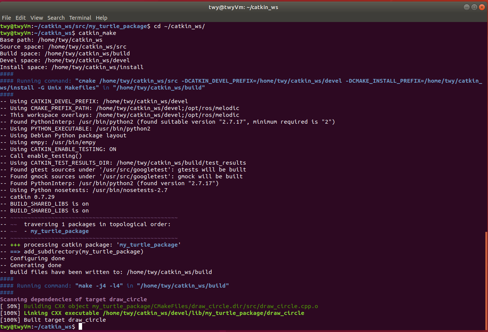
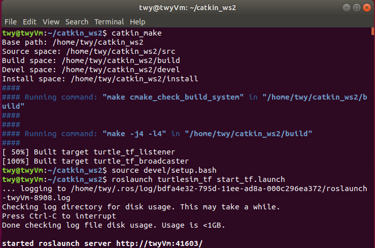

# 小乌龟的随机运行与跟随

## 211250199 汤文源

### 准备工作
- 建立ROS工作空间



- 编译工作空间




- 编写程序并运行

主要的cpp文件：turtle_tf_broadcaster.cpp,turtle_tf_listener.cpp

其中，turtle_tf_broadcaster.cpp控制小乌龟turtle1的随机运行并发送其坐标，

turtle_tf_listener.cpp产生一个新的乌龟turtle2，获取turtle1的坐标，运算后朝向turtle1运动

另外还有一个launch文件负责启动，启动命令：

```
catkin_make
resource devel/setup.bash
roslaunch turtlesim_tf start_tf.launch
```

视频如turtle_randomFollow.mp4所示

此文件包只列举了cpp与launch文件


